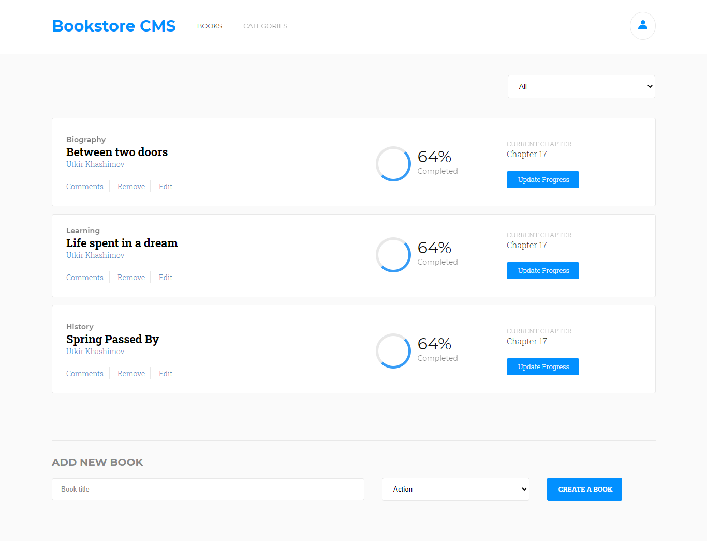

# Bookstore App

- This is React Bookstore app which was built fully using JavaScript and JSX.In this app, you can add and search books from bookstore very easily.

## Live Demo

- [Bookstore](https://infinite-basin-78643.herokuapp.com/)

## Built with

- JavaScript
- React
- JSX
- SCSS
- Node
- Redux

## Getting Started

- Clone the repo `git@github.com:Murodjon000/bookstore.git`
- cd `into` the project
- Run `git pull origin app`
- Run `yarn install` or `npm install` to install dependencies
- On the terminal run `npm run start` open up the live server
- To run tests write `npm run test` on the terminal

## Author

👤 **Murodjon Tursunpulatov**

- Github: [@murodjon000](https://github.com/murodjon000)
- Twitter: [@MurodjonTursun5](https://twitter.com/MurodjonTursun5)
- Linkedin: [@Murodjon Tursunpulatov](https://www.linkedin.com/in/murodjon-tursunpulatov-5189481b3/)

## 🤝 Contributing

Contributions, issues and feature requests are welcome!

Feel free to check the [issues page](issues/).

## Show your support

Give a ⭐️ if you like this project!

## 📝 License

MIT License